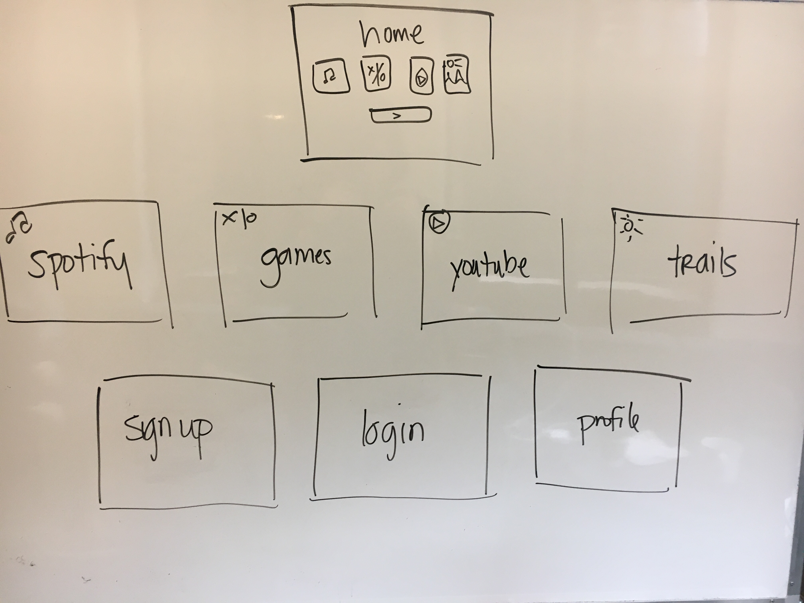
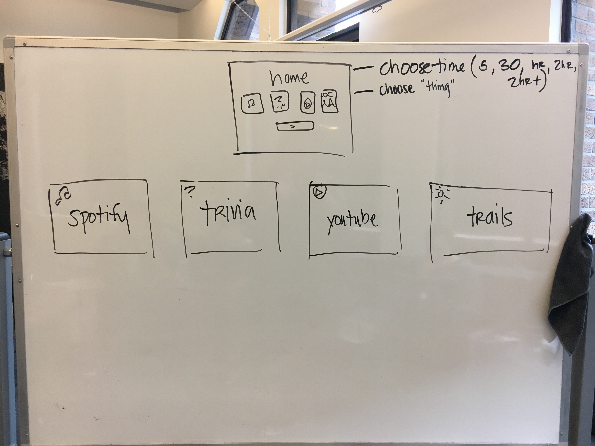
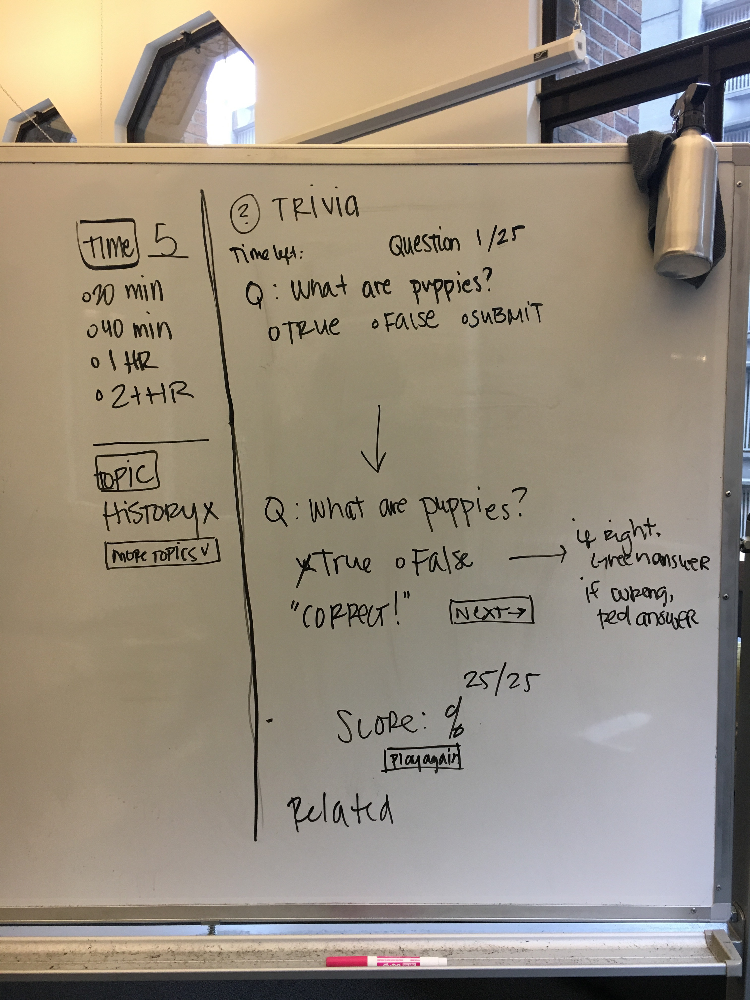
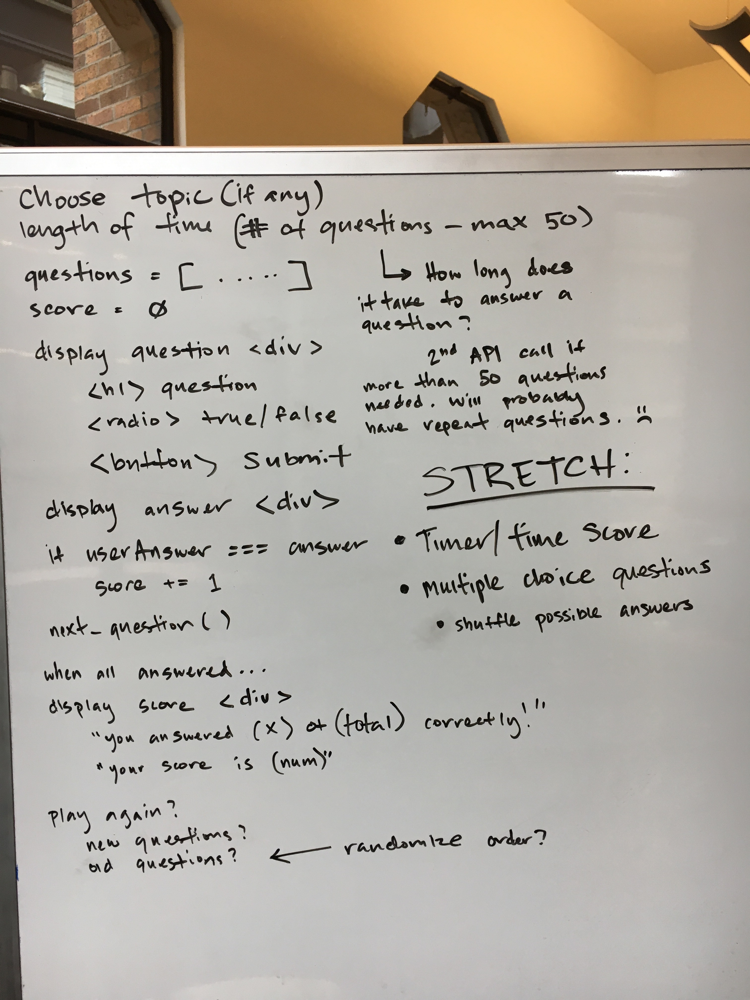

<h1>Chronotron</h1>
<h4>WDI 13 | Project 4 | Alaina, Andrew, Mark, Peter, Sara</h4>

UX/UI Consultant: Ben Frates

“There's never enough time to do all the nothing you want.”

<h3>Purpose and General Approach</h3>

<h3>Tech Used</h3>
<ul>
	<li>Ruby on Rails</li>
	<li>HTML & CSS</li>
	<li>YouTube API</li>
		
Used YouTube to search and display videos based upon relevance in the time allotment. Through allowing the user to search the length and number of videos he or she can search through and find the most relevant video to watch without having to search again. By doing so the user can find myriad topics from one location and consume them.

	<li>Trails API</li>
		
Used Trail for parks and trails information within a specific area. This allows the user to identify hikes, walks, and parks.

	<li>Spotify API</li>
		
Used spotify to make  playlist on the user profile on the time allowed for wasting. The user connects their spotty account to the embedded Iframe which allows for communication with the users web phone applications. This dynamically stores the user’s playlists which can be accessed from any device. By doing this way we have allowed users to take their created playlists wherever they go!

	<li>OpenWeather API</li>
		
Placed weather conditions on the page for the displayed park.

	<li>Open Trivia API</li>
		
Used OpenTrivia to return questions on a topic in true/false or multiple choice format. Then created a javascript game that creates an environment that the user interacts with to play a game of Trivia. The user is told if they get the question right or not and their score is incremented thusly.

</ul>

<h3>Wire Frames</h3>
<ul>
		<li></li>
		<li></li>
    <li></li>
    <li></li>
</ul>

<h3>Installation Instructions:</h3>
<ol>
    <li>Fork/Clone Repository</li>
    <li>Create new folder and clone project</li>
		<li>Create DB</li>
		<li>Migrate DB</li>
    <li>Get API keys from Youtube, GoogleMaps, Spotify, OpenWeather, and GoogleMaps Embed - Then create a .env folder and enter these API keys after each declaration in the ENV file </li>
			<ul>
			<li>SPOTIFY_CLIENT_ID=''</li>
			<li>SPOTIFY_CLIENT_SECRET=''</li>
			<li>DEVELOPER_KEY=''</li>
			<li>YOUTUBE_API_SERVICE_NAME=''</li>
			<li>YOUTUBE_API_VERSION=''</li>
			<li>WEATHER_KEY=''</li>
			<li>GOOGLE_MAP_KEY=''</li>
			<li>MAP_EMBED_KEY=''</li>
			</ul>
    <li>Run Bundle Install</li>
		<li>In console type: Foreman run rails s</li>
</ol>

